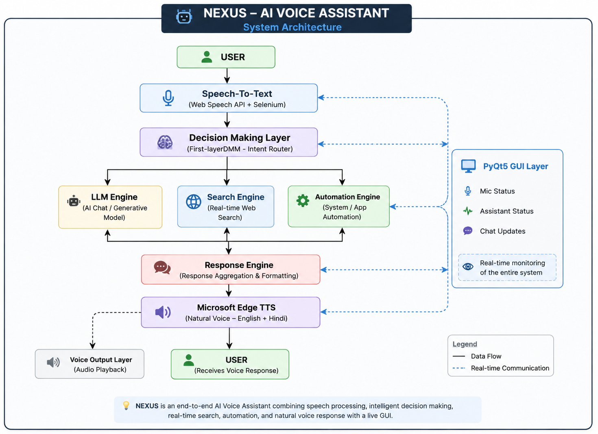

# 🤖 NEXUS — AI Voice Assistant (End-to-End System)

> 🚀 Built from scratch. Engineered like a system. Designed like JARVIS.

NEXUS is a full-stack AI Voice Assistant that integrates real-time speech recognition, intelligent decision making, automation, real-time search, and a custom animated GUI into a seamless, concurrent AI system.

This is not just a chatbot — it is a real-time, multi-layered voice AI architecture.

---

## 🧠 What NEXUS Can Do

- 🎙️ Listens to real-time voice commands  
- 🧠 Understands user intent using a custom AI decision layer  
- 🌐 Answers general + real-time questions  
- ⚙️ Performs system & application automation  
- 🔊 Speaks naturally in English & Hindi  
- 🖥️ Displays live conversation, mic status & assistant state in GUI  
- ⚡ Runs all components concurrently using multithreading  


---

## 🔍 Core System Components

### 🎙️ Speech-to-Text (STT)

- Browser-based Web Speech API (via Selenium)
- Supports English & Hindi
- Real-time transcription
- Thread-safe microphone handling

---

### 🧠 AI Decision Layer (DMM)

- Custom Decision Making Model (FirstLayerDMM)
- Intent classification & query normalization
- Routes queries to:
  - 🤖 LLM Chatbot
  - 🌐 Real-time Search Engine
  - ⚙️ Automation Engine

---

### 💬 Response Generation

- Conversational AI responses
- Live web data retrieval
- Task execution engine

---

### 🔊 Text-to-Speech (TTS)

- Microsoft Edge TTS (Natural Hindi + English)
- Offline fallback using pyttsx3
- Seamless voice switching

---

### 🖥️ Graphical User Interface

- Built with PyQt5
- Arc-Reactor inspired animated UI
- Live:
  - Mic status
  - Assistant status
  - Chat updates
- Real-time backend ↔ frontend synchronization

---

## 🛠️ Tech Stack

### 🔹 Core Engineering
- Python 3.10
- Multithreading
- AsyncIO
- Multiprocessing

### 🔹 AI / NLP
- Custom Decision-Making Model
- LLM-based Chatbot
- Intent parsing & query normalization

### 🔹 Speech Pipeline
- Selenium + Web Speech API (STT)
- Microsoft Edge TTS
- pyttsx3 (Offline fallback)

### 🔹 Automation
- AppOpener
- Keyboard control
- Web automation
- System command execution

### 🔹 GUI
- PyQt5
- QPainter animations
- Real-time file-based synchronization

### 🔹 Other Tools
- dotenv
- pygame
- threading

---

## ⚙️ Engineering Challenges Solved

- ✅ Thread-safe microphone control  
- ✅ Prevented infinite STT loops  
- ✅ Real-time GUI ↔ backend communication  
- ✅ Natural Hindi voice synthesis  
- ✅ Clean frontend-backend separation  
- ✅ Concurrent pipeline orchestration  

---

## 🎯 What This Project Demonstrates

This system reflects strong understanding of:

- System-level Python architecture  
- Real-time concurrency  
- Voice AI pipelines  
- Multi-layer decision systems  
- GUI + backend synchronization  
- Production-style debugging  

---

## 📂 Project Structure
NEXUS/
│
├── backend/
│ ├── chatbot.py
│ ├── model.py
│ ├── speechtotext.py
│ ├── texttospeech.py
│ └── RealtimeSearchEngine.py
│
├── frontend/
│ ├── GUI.py
│ └── graphics/
│
├── data/
├── main.py
└── requirements.txt


---
## 🏗️ System Architecture

<p align="center">
 
</p>

> High-level architecture of NEXUS showing speech processing, intent routing, AI services, automation, GUI synchronization, and voice response generation.
## ⚙️ Installation

```bash
git clone https://github.com/abhiuhekk/-NEXUS-A-Full-Stack-AI-Voice-Assistant-with-Speech-Intelligence.git
cd NEXUS
pip install -r requirements.txt
python main.py
